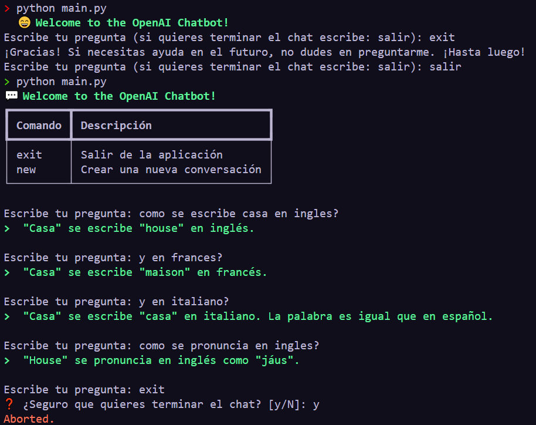

# CHATGPT API WITH PYTHON

## First
You need to add your api ley for openai.com

    export OPENAI_APY_KEY=asdasdasdasdasdadsad


## Example
Show the image:

```

```

## References

- openapi library: https://github.com/openai/openai-python
- openapi API Documentation: https://platform.openai.com/docs/api-reference/chat/create 