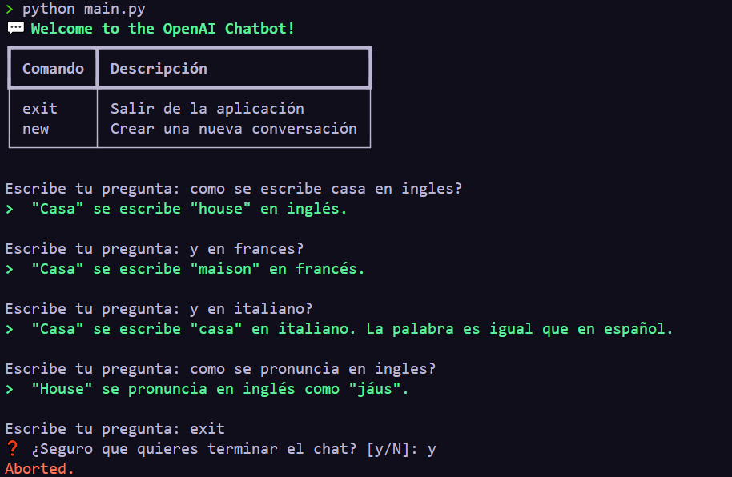

# CHATGPT API WITH PYTHON

## First
You need to add your api key for openai.com
```bash
export OPENAI_APY_KEY=asdasdasdasdasdadsad
```

## Install dependencies and run

Installing dependencies
```bash
pip install -r requirements.txt
```

Then run the program
```bash
python main.py
```

## Example




## References

- openapi library: https://github.com/openai/openai-python
- openapi API Documentation: https://platform.openai.com/docs/api-reference/chat/create 